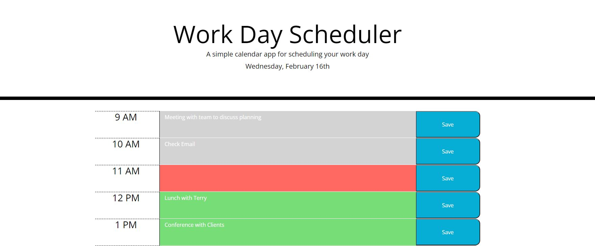

# proj-sched-5
## Work Day Scheduler
### Description: 
A work day agenda that allows the user to add events to each hour in the work day
### Features:
* Date is displayed at the top of the page
* Each event will be saved to local storage when the correspoinding save button is clicked
* Hours are color coded: gray for the past, pink for current, and green for future
* The date and time are updated every minute
### Link:
https://bfortenberry22.github.io/proj-sched-5/

## Images:

